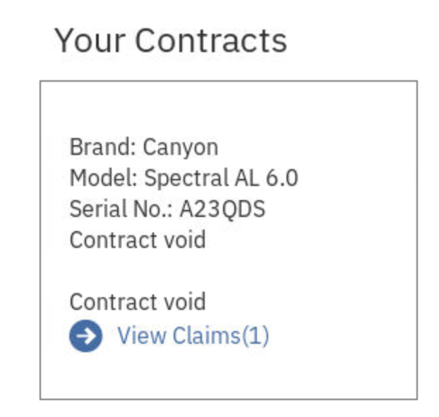

*Read this in other languages: [中国語](README-cn.md),[日本語](README-ja.md).*

# Build Blockchain Insurance Application

This project showcases multiple participants in a business network working together and using blockchain as the source of truth. In this application, we have four participants: insurance, police, repair shop and shop peer. Insurance peer is the insurance company providing the insurance for the products and it is responsible for processing the claims. Police peer is responsible for verifying the theft claims. Repair shop peer is responsible for repairs of the product while shop peer sells the products to consumer.


## Included Components
* Hyperledger Fabric
* Docker

## Application Workflow Diagram


## Prerequisites
For this lab, we will be utilizing a VM with our prerequisites installed. If you do not have a VM, let the lab instructor know.


## 1. Run the application
Once you have logged into your workshop VM, click on **Applications** at the top left of the VM, hover your mouse over favorites, and click on **Terminal**.


Then, run the following command to change into your *Documents* directory:
```
cd Documents/
```


Clone the repository:
```bash
git clone https://github.com/odrodrig/build-blockchain-insurance-app
```


Now we need to run the build script to download and create docker images for the orderer, insurance-peer, police-peer, shop-peer, repairshop-peer, web application and certificate authorities for each peer. 

Run the following commands in your terminal window (This will run for a few minutes.):

```bash
cd build-blockchain-insurance-app
./build_ubuntu.sh
```

You should see the following output on console:
```
Creating repairshop-ca ...
Creating insurance-ca ...
Creating shop-ca ...
Creating police-ca ...
Creating orderer0 ...
Creating repairshop-ca
Creating insurance-ca
Creating police-ca
Creating shop-ca
Creating orderer0 ... done
Creating insurance-peer ...
Creating insurance-peer ... done
Creating shop-peer ...
Creating shop-peer ... done
Creating repairshop-peer ...
Creating repairshop-peer ... done
Creating web ...
Creating police-peer ...
Creating web
Creating police-peer ... done
```

**Wait for few minutes for application to install and instantiate the chaincode on network**

Check the status of installation using command:
```bash
docker logs web
```
On completion, you should see the following output on console:
```
> blockchain-for-insurance@2.1.0 serve /app
> cross-env NODE_ENV=production&&node ./bin/server

/app/app/static/js
Server running on port: 3000
Default channel not found, attempting creation...
Successfully created a new default channel.
Joining peers to the default channel.
Chaincode is not installed, attempting installation...
Base container image present.
info: [packager/Golang.js]: packaging GOLANG from bcins
info: [packager/Golang.js]: packaging GOLANG from bcins
info: [packager/Golang.js]: packaging GOLANG from bcins
info: [packager/Golang.js]: packaging GOLANG from bcins
Successfully installed chaincode on the default channel.
Successfully instantiated chaincode on all peers.
```

🚨🚨At this point, if you run into any errors, please check the troubleshooting section at the 
bottom of the page for 
common fixes! This is likely due to a difference in Ubuntu, Docker, or Docker-compose version.🚨🚨

Use the link http://localhost:3000 to load the web application in browser.

The home page shows the participants (Peers) in the network. You can see that there is an Insurance, Repair Shop, Police and Shop Peer implemented. They are the participants of our blockchain network.


Imagine being a consumer (hereinafter called “Biker”) that wants to buy a phone, bike or Ski. By clicking on the “Go to the shop” section, you will be redirected to the shop (shop peer) that offers you the different products.


You can see the three products offered by the shops. In addition, you have insurance contracts available for them. In our scenario, you are an outdoor sport enthusiast who wants to buy a new Bike. Therefore, you’ll click on the Bike Shop section.


In this section, you are viewing the different bikes available in the store. You can select between four different Bikes. By clicking on next you’ll be forwarded to the next page which will ask for the customer’s personal data.

>Note: If you are stuck on a page that says "Loading contracts", click on **Blockchain for Insurance** in the upper left side of the page, and redo the process of clicking on shop peer, selecting the bike shop, and buying a bike.


You have the choice between different insurance contracts that feature different coverage as well as terms and conditions.

Feel free to type in fake information for the personal data and select a start and end date of the contract. Since there is a trend of short-term or event-driven contracts in the insurance industry you have the chance to select the duration of the contract on a daily basis. The daily price of the insurance contract is being calculated by a formula that had been defined in the chaincode. By clicking on next you will be forwarded to a screen that summarizes your purchase and shows you the total sum.


The application will show you the total sum of your purchase. By clicking on “order” you agree to the terms and conditions and close the deal (signing of the contract). In addition, you’ll receive a unique username and password. The login credentials will be used once you file a claim.  A block is then written to the Blockchain.

>note You can see the block by clicking on the black arrow on the bottom-right of the page.


Save the login information for later by pasting it in a notepad doc or by simply writing it down.


Once an incident has happened the Biker can file a claim on his own. Hover your mouse over **Insurance** in the top right side of the page and select **Claim Self-Service**.


Log in with the credentials that were just given to you.


Click on **File a New Claim**


From here, the Biker can briefly describe the damage on his bike and/or select whether it has been stolen. 

If the bike has been stolen, the claim will need to be processed through the police who has to then confirm or deny the theft (option 1). 

If the bike was just damaged, then the claim will be processed through the repair shop (option 2). 

In the following section, we will start with option 1.

**Option 1**

Click the checkbox for **Theft** and click **submit**. At this point, another block is then written to our chain.


Hover your mouse over **Insurance** in the top right side of the page and select **Claim Self-Service**.

Log in again with your credentials. 

Click on **View Claims** as seen below.


From here, you can view all active claims.


Now we are going to operate as the insurance company that is handling the claim that was just submitted by the biker.

Hover your mouse over **Insurance** in the top right of the page and select **claim processing**.

From here the Insurance company can view all active claims that have not been processed yet. A clerk can decide on the claims in this view. 

Since we are dealing with a theft claim, we can't confirm the claim until the theft has been confirmed with the police. We know it hasn't been confirmed by the police yet because the only option available to us is to reject the claim, **which we do not want to do**.

We'll come back to this later.


Now we will change gears and operate as the police who will confirm if a report of a stolen bike has been submitted.

Click on **Police** in the top right of the page.

>Note: If you are stuck on a page that says "Loading theft claims", click on **Blockchain for Insurance** at the top left of the page, and select *Go to the police peer* near the bottom of the page.


From here, the police can view the claims that include theft. If the bike has in fact been reported stolen they can confirm the claim and include a file reference number. If no theft has been reported they can reject the claim and it will not be processed.

It doesn't matter what you put in *File Reference* this is just so that the police in our use case can reference a police report in this claim. 

Click on **Confirm**


Now that the theft claim has been confirmed, it will no longer appear in the list of theft claims.


Let's switch back into our view as an insurance company. Hover your mouse over **Insurance** in the top right of the page and select **Claim processing**.

You should see your claim that was submitted before, however, this time we have the option to reimburse the biker for the stolen bike. We are now able to do this because the theft has been confirmed by the police.

For the **Reimbursable** field, enter **400** and click on **Reimburse**.


Now we are going to switch back to our view as the biker.

Hover your mouse over **Insurance** in the top right side of the page and select **Claim self-service**

Then, log in with the credentials from earlier.

Click on **View claim** for our existing contract.



Now you can see that our claim has been approved and that the biker will be reimbursed. We can also see the police report's file reference number (if you entered that earlier), and the amount of reimbursement ($400).


## Optional


**Option 2**

Now let's take a look at a second scenario where instead of a bike being stolen, the bike is just damaged.

Hover your mouse over **Shop** in the top right of the page and select **Bikes**. 

Then go through the process of buying a bike, entering fake personal information, and getting the log in credentials like we did earlier.

Next, hover your mouse over **Insurance** in the top right side of the page and select **Claim self-service** and log in with your credentials.


Now you should your contract appear. Click on **File a new claim**


**Leave the theft box unchecked** and for **Description** enter the following:
```
Had a hard fall
```


Then click **Submit**

Now we will switch views and operate as the insurance company to process the claim.


Hover your mouse over **Insurance** in the top right of the page and select **Claim processing**.

From here, like before, the clerk can manage the claim. However, since this is not a theft case, there is no need to confirm with the police. The clerk can choose to repair the bike, or they can reimburse the value of the bike if the damage is too severe to repair.

Click on **Repair**. This will forward the request to the repair shop and generate a repair order.


Now let's become the repair shop and process the repair order.

Click on **Repair Shop** in the top right of the page.

>Note: If you are stuck on a page that says "Loading repair orders", click on **Blockchain for Insurance** at the top left of the page, and select *Go to the repair shop peer* near the left side of the page.


Here you can see the available repair orders. At this point, the repair shop would do the necessary repairs on the bike and when done, would pass the claim back to the insurance company.

Click on **Mark completed**


With that done, the biker gets their bike from the repair shop all fixed up and the insurance company would then pay the repair shop for the repairs that were done.


## Additional resources
Following is a list of additional blockchain resources:
* [Fundamentals of IBM Blockchain](https://www.ibm.com/blockchain/what-is-blockchain)
* [Hyperledger Fabric Documentation](https://hyperledger-fabric.readthedocs.io/)
* [Hyperledger Fabric code on GitHub](https://github.com/hyperledger/fabric)

## Troubleshooting

If you see any errors, before re running the build script, make sure to clean your system:


* Run `clean.sh` to remove the docker images and containers for the insurance network.
```bash
./clean.sh
```

Next, if you see the following error: 

```Peer joined default channel
Connecting and Registering Block Events
Chaincode is not installed, attempting installation...
Base container image present.
Successfully installed chaincode on the default channel.
Fatal error instantiating chaincode on some(all) peers!
Error: Proposal rejected by some (all) of the peers: Error: error starting container: error starting container: API error (404): network build-blockchain-insurance-app_default not found
    at /app/www/blockchain/utils.js:252:15
```

Go ahead and update the follwing line in the [peer-base.yaml file](https://github.com/IBM/build-blockchain-insurance-app/blob/master/peer-base.yaml#L7)

It should now read:
```yaml
   - CORE_VM_DOCKER_HOSTCONFIG_NETWORKMODE=buildblockchaininsuranceapp_default
```

I.e. the whole `peer-base.yaml` file should look like the following:

```yaml
version: '2'

services:
  peer-base:
    environment:
    - CORE_VM_ENDPOINT=unix:///host/var/run/docker.sock
    - CORE_VM_DOCKER_HOSTCONFIG_NETWORKMODE=buildblockchaininsuranceapp_default
    - CORE_LOGGING_LEVEL=DEBUG
    - CORE_PEER_TLS_ENABLED=true
    - CORE_PEER_ENDORSER_ENABLED=true
    - CORE_PEER_GOSSIP_USELEADERELECTION=true
    - CORE_PEER_GOSSIP_ORGLEADER=false
    - CORE_PEER_PROFILE_ENABLED=true
    - CORE_PEER_MSPCONFIGPATH=/peer/crypto/msp
    - CORE_PEER_TLS_CERT_FILE=/peer/crypto/tls/server.crt
    - CORE_PEER_TLS_KEY_FILE=/peer/crypto/tls/server.key
    - CORE_PEER_TLS_ROOTCERT_FILE=/peer/crypto/tls/ca.crt
    working_dir: /peer
    command: peer node start
    volumes:
    - /var/run/:/host/var/run/
```

Now, try and re-run the build script. If you get the following error after changing the 
`peer-base.yaml` file, you may need to change the [Dockerfile in the /web directory](https://github.com/IBM/build-blockchain-insurance-app/blob/master/web/Dockerfile).

If you get this error:

```
Peer joined default channel
Connecting and Registering Block Events
Chaincode is not installed, attempting installation...
Base container image present.
Successfully installed chaincode on the default channel.
2019-06-18T17:56:22.641Z - error: [Peer.js]: sendProposal - timed out after:45000
Fatal error instantiating chaincode on some(all) peers!
Error: Proposal rejected by some (all) of the peers: Error: REQUEST_TIMEOUT
at /app/www/blockchain/utils.js:243:15
at Generator.next ()
at step (/app/bin/blockchain/utils.js:103:191)
at /app/bin/blockchain/utils.js:103:361
at
at process._tickCallback (internal/process/next_tick.js:188:7)
npm ERR! code ELIFECYCLE
```

Go ahead and change the Dockerfile in the /web directory to the following:

```Docker
FROM docker.io/library/node:8.9.0
ENV NODE_ENV production
ENV PORT 3000
ENV DOCKER_SOCKET_PATH /host/var/run/docker.sock
ENV DOCKER_CCENV_IMAGE hyperledger/fabric-ccenv:latest
RUN mkdir /app
COPY . /app
WORKDIR /app
RUN npm i && npm i --only=dev \
&& npm run build \
&& npm prune
EXPOSE 3000
CMD ["npm", "run", "serve"]
```

Go ahead and run the ./clean script, and then docker login, and then try and run the 
./build_ubuntu script again. For more info, refer to this issue: https://github.com/IBM/build-blockchain-insurance-app/issues/79


## License
This code pattern is licensed under the Apache Software License, Version 2.  Separate third party code objects invoked within this code pattern are licensed by their respective providers pursuant to their own separate licenses. Contributions are subject to the [Developer Certificate of Origin, Version 1.1 (DCO)](https://developercertificate.org/) and the [Apache Software License, Version 2](https://www.apache.org/licenses/LICENSE-2.0.txt).

[Apache Software License (ASL) FAQ](https://www.apache.org/foundation/license-faq.html#WhatDoesItMEAN)
